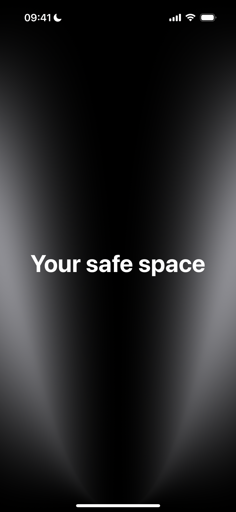
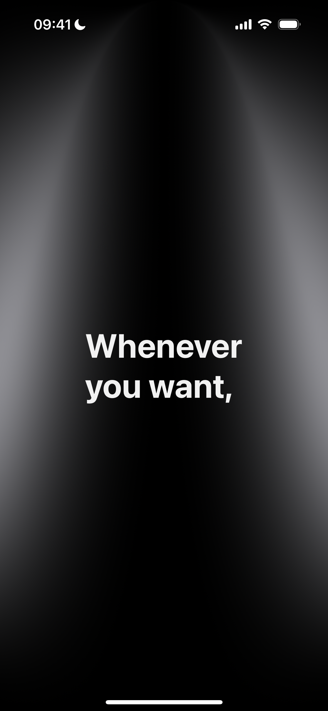
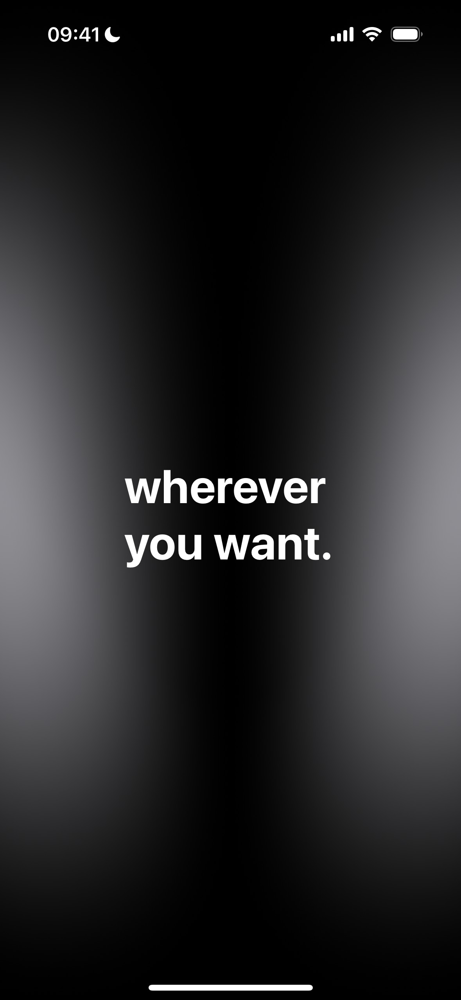
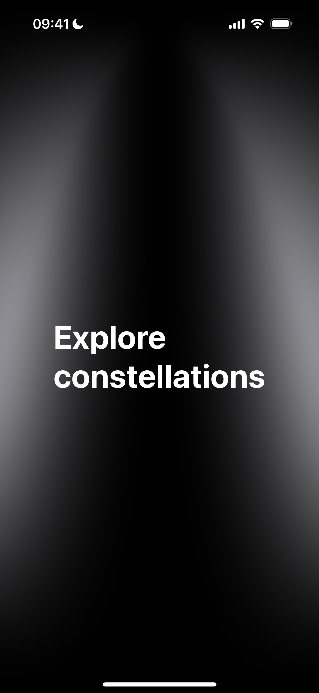
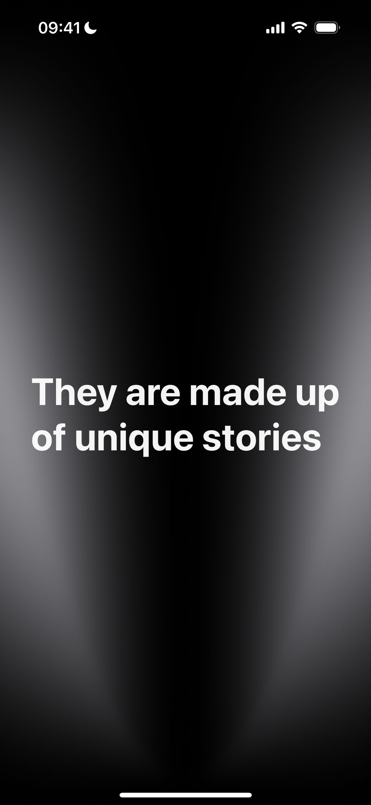
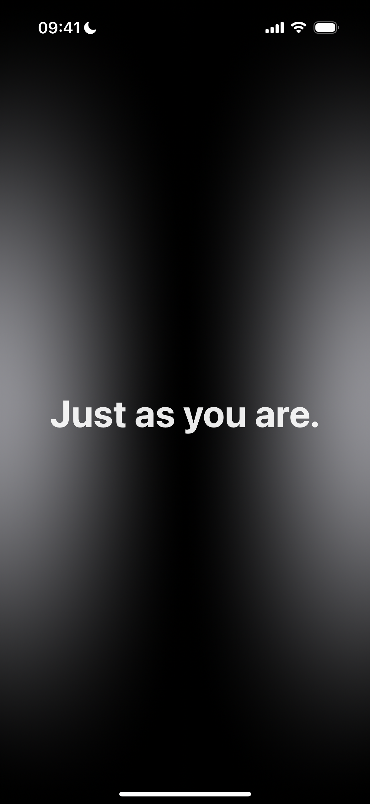
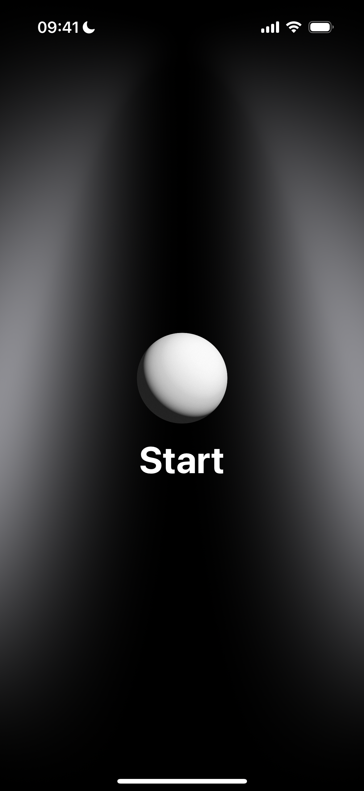

# CelestiaT ✨

*Navigate the night sky of shared experiences*

CelestiaT transforms personal stories from the trans community into a beautiful celestial experience. Each person becomes a unique constellation in our digital night sky, formed by the collection of experiences that shaped their journey. 

## 🌟 About

In CelestiaT, every individual is represented as their own constellation—a unique assembly of experiences, struggles, victories, and moments that define who they are. These personal galaxies of stories create a vast, explorable universe where community members can share their authentic voices and others can discover connections through shared experiences.

The app invites you to journey through this night sky, find constellations that resonate with you, and immerse yourself in the stories that form them. It's a space for visibility, connection, and understanding—where every story matters and every voice adds another star to our collective sky.

## 🚀 How It Works

### Onboarding Experience
When you first open CelestiaT, you're welcomed with an introduction to this unique storytelling universe. The onboarding guides you through what to expect and how to navigate this celestial collection of experiences.

  
  
  
  

  
  
  

### Exploring the Night Sky
The main interface presents an interactive, pinch-to-zoom view of personal constellations scattered across the digital cosmos. Each constellation represents one person's collection of shared stories—the more stories they've contributed, the more stars form their unique pattern in the sky.

  

### Reading the Stories
Tap any constellation to dive into that person's experiences. Stories unfold as you scroll horizontally, letting you move through each narrative at your own pace while remaining immersed in the celestial theme.

  
  
  
  

## 🎯 Our Mission

CelestiaT exists to:
- **Amplify trans voices** by providing a beautiful platform for story sharing
- **Foster connection** through the discovery of shared experiences and emotions
- **Create visibility** for the diverse experiences within the trans community
- **Build understanding** by making personal stories accessible and engaging

## 🌌 The Metaphor

Just as real constellations are formed by stars that appear connected from our perspective on Earth, each person in CelestiaT is a constellation formed by the experiences that connect to create their unique story. No two constellations are the same, yet they all contribute to the beauty of the night sky we share.

## 👥 Team

**CelestiaT** was created with love by:
- **Cristina Valenziano**
- **Gina Saviano** 
- **Matteo Romano**
- **Luis Mario Recinos Hernández**
- **Pasquale Piserchia**

---

*TOGETHER WE DON’T JUST BUILD TECHNOLOGY, WE FOSTER COMMUNITY.*

---
Try the app on TestFlight: https://testflight.apple.com/join/ufA8Mt8t
